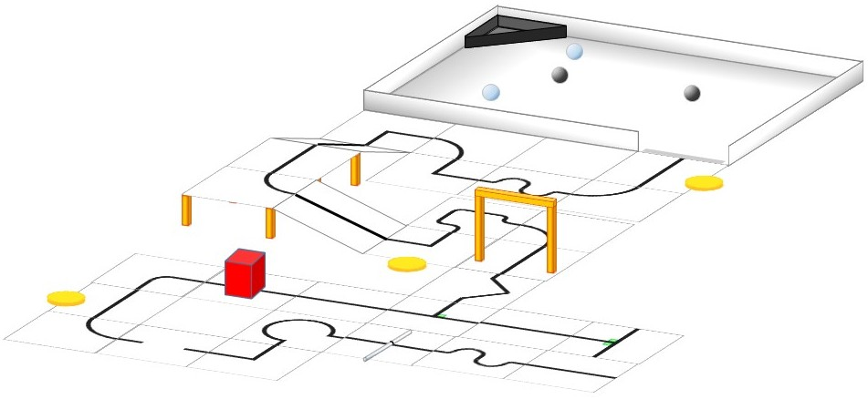
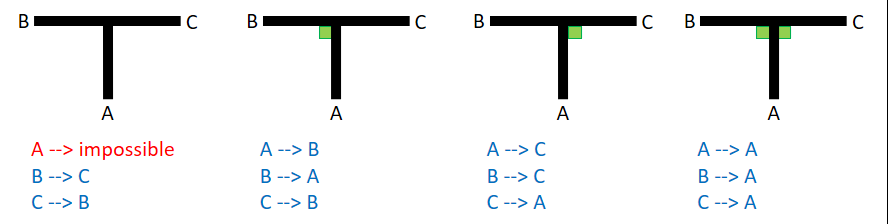
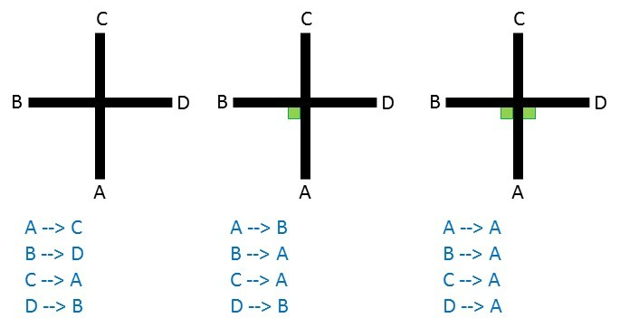
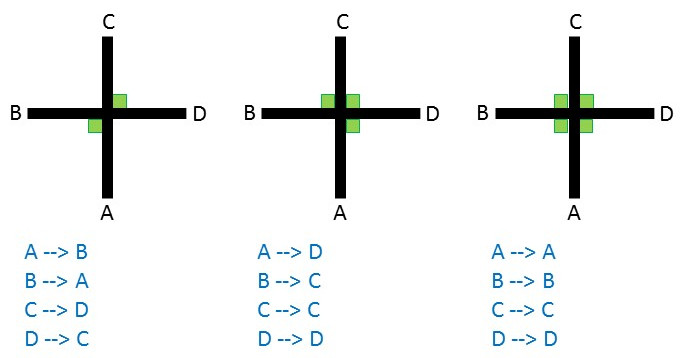

= RoboCupJunior Rescue Line Rules 2019
{docdate}
:toc: left
:sectanchors:
:sectlinks:
:xrefstyle: full
:section-refsig: Rule
:sectnums:

ifdef::basebackend-html[]
++++
<link rel="stylesheet" href="https://use.fontawesome.com/releases/v5.3.1/css/all.css" integrity="sha384-mzrmE5qonljUremFsqc01SB46JvROS7bZs3IO2EmfFsd15uHvIt+Y8vEf7N7fWAU" crossorigin="anonymous">

++++
endif::basebackend-html[]

:icons: font
:numbered:

These are the official rules for RoboCupJunior Rescue Line 2019. They are released by the RoboCupJunior Rescue Technical Committee. The English rules have priority over any translations.

[scenario]
== Scenario

The land is simply too dangerous for humans to reach the victims. Your team has been given a difficult task. The robot must be able to carry out the rescue mission in a fully autonomous mode with no human assistance. The robot must be durable and intelligent enough to navigate through treacherous terrain with hills, uneven land and rubble without getting stuck. When the robot finally finds the victims, it has to gently and carefully transport the victims to the safe evacuation point where humans can take over the rescue. After the victim rescue, the robot should be able to find its way out of the dangerous area.
Time and technical skills are the essential! Come prepared to be the most successful rescue team.

[summary]
== Summary

An autonomous robot should follow a black line while overcoming different problems in a modular field formed by tiles with different patterns. The floor is white in colour and the tiles are on different levels connected with ramps.

Teams are not allowed to give their robot any advance information about the field as the robot is supposed to recognize the field by itself. The robot earns points as follows:

* 15 points for following the correct path on a tile at an intersection or a dead end.
* 10 points for overcoming an obstacle (bricks, blocks, weights and other large, heavy items). A robot is expected to navigate the various obstacles.
* 10 points for reacquiring the line after a gap.
* 5 points for negotiating a speed bump or navigating through a ramp.

If the robot gets stuck in the field, it can be restarted at the last visited checkpoint. The robot will earn points when it reaches new checkpoints. At the end of the line there will be a rectangular room with walls (the evacuation zone). The entrance to the room will be marked with a strip of reflective silver tape on the floor. 

Once inside the evacuation zone, the robot should locate and transport as many live victims (reflective silver balls of 4-5 cm diameter that are electrically conductive) or dead victims (black balls of 4-5 cm diameter that are not electrically conductive) as possible to an evacuation point in one of the corners of the room, the robot should distinguish between live and dead victims and save live victims first. The robot can earn between 5 to 40 points for each victim depending of the difficulty level and order of rescue. The robot may face obstacles/speed bumps/debris in the evacuation zone. The robot will not score points by negotiating these difficulties.

*Official RoboCupJunior site:* http://robocupjunior (under Rescue)

*Official RoboCupJunior forum:* https://junior.forum.robocup.org/

== Field

=== Description

The field is made up of modular tiles, which can be used to make an endless number of different courses for the robots to traverse.

The field will consist of 30 cm x 30 cm tiles, with different patterns. The final selection of tiles and their arrangement will not be revealed until the day of the competition. Competition tiles may be mounted on a hard-backing material of any thickness.

There will be a minimum of 8 tiles in a competition field.

There are different tile designs (examples can be found under <<field-line>>).

=== Floor

The floor is white in colour. The floor may be either smooth or textured (like linoleum or carpet) and may have steps of up to 3 mm height in between tiles. Due to the nature of the tiles, there may be a step and/or gap in the construction of the field. These are not intentional and will be minimized as much as possible by the organizers.

Competitors should be aware that tiles may be mounted on thick backing or raised off the ground, which may make it difficult to get back on a tile where the robot comes off the course. No provision will be made to assist robots that drive off of a tile to get back onto the tile.

Tiles will be used as ramps to allow the robots to "climb" up to and down from different levels. Ramps will not exceed an incline of 25 degrees from the horizontal.

Robots must be designed so that they can navigate under tiles that form bridges over other tiles. The minimum height (space between the floor and the ceiling) will be 25 cm.

[[field-line]]
=== Line

The black line, 1-2 cm wide, may be made with standard electrical insulating tape or printed onto paper or other materials. The black line forms a path on the floor. (The grid lines indicated in the drawings are for reference only and competitors can expect tiles to be duplicated, added and/ or omitted.)

Straight sections of the black line may have gaps with at least 5 cm of straight line before each gap as measured from the shortest portion of the straight portion of the line. The length of a gap will be no more than 20 cm.

The arrangement of the tiles and paths may vary between rounds.

The line will be 10 cm away from any edge of the field.

image::media/line/line_examples.jpg[]

=== Speed Bumps, Debris and Obstacles

Speed bumps will have a height of 1cm or less and will be white. When the speed bump is placed over any black line, the overlap between the speed bump and the black line will be coloured black.

Debris will have a maximum height of 3 mm. It will not be fixed to the floor. Debris consists of small materials such as toothpicks or small wooden dowels, etc.

Debris may be adjacent to walls.

Obstacles may consist of bricks, blocks, weights and other large, heavy items. Obstacles will be at least 15cm high. 

An obstacle may not occupy more than one line.

A robot is expected to navigate around obstacles. The robot may move obstacles but it should be noted that obstacles may be very heavy or fixed to the floor. Obstacles that are moved will remain where they moved to, even if that prevents the robot from proceeding.

=== Intersections and dead ends

Intersections can be placed anywhere except in the evacuation zone.

Intersections markers are green and 25 mm x 25 mm in dimension. They indicate the direction of the path the robot should follow. 

If there is not a green marker at an intersection, the robot should continue straight ahead.

A dead end is when there are two green marks before an intersection (one on each side of the line), in this case the robot should turn around.

The intersections are always perpendicular but may have 3 or 4 branches. 

Intersection markers will be placed just before the intersection. See the images below for possible scenarios.

=== Doorway

The field layout may have doorways. If present in a field, doorways will be at least 25 cm wide and 25 cm high. 

Doorways are located on straight sections of the line.

Doorways will be fixed to the floor.

=== Evacuation Zone

The black line will end at the entrance of the evacuation zone. 

The evacuation zone is approximately 120 cm by 90 cm with walls around the 4 sides that are at least 10 cm high.

At the entrance to the evacuation zone, there is a 25 mm x 250 mm strip of reflective silver tape on the floor.

Teams can choose between two different evacuation point tiles, which are both right angled triangles with sides of 30 cm x 30 cm:

* Level one: The evacuation point is a black triangle with a bump of 5mm along the side that does not touch a wall.
* Level two: The evacuation point is a black triangle with 6cm walls and a hollow centre.

image::media/line/evacuation_zones.png[float="left"]
Level one and Level two

=== Victims

Victims may be located anywhere on the floor of the evacuation zone.

A victim represents a person and is in the form of a 4-5 cm diameter ball.

There are two types of victims:

* Dead victims are black and not electrically conductive.
* Living victims are silver, reflect light and are electrically conductive.

=== Environmental Conditions

The environmental conditions at a tournament will be different from the conditions at home practice field.  Teams must come prepared to adjust their robots to the conditions at the venue.

Lighting and magnetic conditions may vary in the rescue field.

The field may be affected by magnetic fields (e.g. generated by under floor wiring and metallic objects). Teams should prepare their robots to handle such interference. Organizers and referees will do their best to minimize external magnetic interference.

The field may be affected by unexpected lightning interference (e.g. such as camera flash from spectators). Teams should prepare their robots to handle such interference. Organizers and referees will do their best to minimize external lighting interference. 

All measurements in the rules have a tolerance of ±5%.

== Robots

=== Control

Robots must be controlled autonomously. The use of a remote control, manual control, or passing information (by sensors, cables, wirelessly, etc.) to the robot is not allowed.

Robots must be started manually by the team captain.

Any pre-mapped type of dead reckoning (movements predefined based on known locations or placement of features in the field) is prohibited.

Robots must not damage any part of the field in any way.

=== Construction

Any robot kit or building blocks, either available on the market or built from raw hardware, may be used as long as the design and construction of the robot are primarily and substantially the original work of the students.

Teams are not permitted to use any commercially produced robot kits or sensors components that are specifically designed or marketed to complete any single major task of RoboCupJunior Rescue. Robots that do not comply will face immediate disqualification from the tournament.  If there is any doubt, teams should consult the Technical Committee (TC) prior to the competition.

For the safety of participants and spectators, only lasers of class 1 and 2 are allowed. This will be checked during inspection. Teams using lasers must be able to show the sensor’s data/information sheet. 

Bluetooth Class 2, 3 and ZigBee communications are the only wireless communication types allowed in RoboCupJunior. Robots that have other types of wireless communications will need to be removed or disabled to prevent possible interference with other leagues competing in RoboCup. If the robot has equipment for other forms of wireless communication, the team must prove that they have been disabled. Robots that do not comply may face immediate disqualification from the tournament.

Robots may incur damage by falling off the field, making contact with another robot, or making contact with field elements.  The organizing committee cannot anticipate all potential situations where damage to the robot may occur. Teams should ensure that all active elements on a robot are properly protected with resistant materials. For example, electrical circuits must be protected from all human contact and direct contact with other robots and field elements. 

When batteries are transported or moved, it is recommended that safety bags be used. Reasonable efforts should be made to ensure that robots avoid short circuits and chemical or air leaks.

=== Team

Each team must have only one robot on the field. 

Each team must have between 2 and 4 members.

Each team member will need to explain their work and should have a specific technical role.

A student can be registered on only one team.

A team is only allowed to participate in one league: Rescue Line or Rescue Maze.

All team members must be the correct age as stated on the RCJ website: http://junior.robocup.org/robocupjunior-general-rules/.

Team members may compete in Rescue Line twice (2 international events). After competing in Rescue Line twice, they must move to another RoboCupJunior subleague.
A student will not be able to participate in the RoboCupJunior, Sydney 2019 if he/she has participated in any two of the following international competitions: RoboCupJunior, Hefei 2015 Rescue Line Secondary, RoboCupJunior, Leipzig Rescue Line Secondary, RoboCupJunior, Nagoya 2017 Rescue Line or RoboCupJunior, Montreal 2018 Rescue Line.

Mentors/parents are not allowed to be with the team members during the competition. The team members will have to self-govern themselves (without mentor's supervision or assistance) during the long stretch of hours at the competition.

=== Inspection

The robots will be scrutinized by a panel of referees before the start of the tournament and at other times during the competition to ensure that they meet the constraints described in these rules.

It is illegal to use a robot that is very similar to another team’s robot from a previous year or the current year.

It is the responsibility of the team to have their robot re-inspected, if their robot is modified at any time during the tournament.

Students will be asked to explain the operation of their robot in order to verify that construction and programming of the robot is their own work.

Students will be asked about their preparation efforts and may be requested to answer surveys and participate in video-taped interviews for research purposes.

All teams must complete a web form prior to the competition to allow judges to better prepare for the interviews.  Instructions on how to submit the form will be provided to the teams prior to the competition. 

All teams have to submit their source code prior to the competition. The source code will not be shared with other teams without the team’s permission.

All teams must submit their engineering journal prior to the competition. The journals will not be shared with other teams without the team’s permission. However, it is highly recommended that teams publicly share their engineering journal. With the teams that indicate that their engineering journals could be shared publicly during the registration process, the journal alongside their poster presentation will be shared through the RoboCupJunior Forum so that other teams could learn from them.

=== Violations

Any violations of the inspection rules will prevent the offending robot from competing until modifications are made and the robot passes inspection.

Modifications must be made within the time schedule of the tournament and teams cannot delay tournament play while making modifications.

If a robot fails to meet all specifications (even with modifications), it will be disqualified from that round (but not from the tournament).

No mentor assistance is allowed during the competition. (See 6. Code of Conduct.)

Any violations of the rules may be penalized by disqualification from the tournament or the round or may result in a loss of points at the discretion of the referees, officials, organizing committee or general chairs.

== Play

=== Pre-round Practice

When possible, teams will have access to practice fields for calibration and testing throughout the competition.

Whenever there are dedicated independent fields for competition and practice, it is at the organizers’ discretion if testing is allowed on the competition fields.

=== Humans

Teams should designate one of their members as “captain” and another one as “co-captain.” Only these two team members will be allowed access to the competition fields, unless otherwise directed by a referee. Only the captain will be allowed to interact with the robot during a scoring run.  

The captain can move the robot only when they are told to do so by a referee.

Other team members (and any spectators) within the vicinity of the rescue field have to stand at least 150 cm away from the field while their robot is active, unless otherwise directed by a referee.

No one is allowed to touch the fields intentionally during a scoring run.

=== Start of Play

A run begins at the scheduled starting time whether or not the team is present or ready. Start times will be posted around the venue.

Before the scoring run begins, the team defines which evacuation point tile should be used (see 1.7.4).

The checkpoint marker is a marker that indicates for humans which tiles are checkpoints. It can be 5 mm to 12mm thick and up to 70 mm in diameter. The number of possible checkpoints will depend on the length of the course.

Before the scoring run starts, the team captain will decide which tiles should be checkpoints and place the markers on those tiles. 

Only one checkpoint marker may be placed on a tile.  Checkpoint markers may not be placed on tiles with scoring elements. Once the scoring run has begun (see 3.3.11), the markers cannot be changed. Note: If a robot moves a marker, it is still the original tile that is the checkpoint. The marker is only there for humans to remember where the checkpoints are located.

The start tile is a checkpoint, where the robot can restart. The team can't use one of their checkpoint markers for the start tile.

Once the scoring run has begun, the robot is not permitted to leave the competition area.

Each team will be given a maximum time of 8 minutes to calibrate the sensors, select the checkpoints and let the robot complete the course. The time for each run will be kept by the referee.

Calibration is defined as taking sensor readings and modifying the robot's programming to accommodate such sensor readings. Any and all pre-mapping activities will result in immediate disqualification of the robot for the round.

Teams may calibrate their robot in as many locations as desired on the field, but the clock will continue to run. Robots are not permitted to move on their own while calibrating. 

Once a team is ready to start a scoring run, they must notify the referee. To begin a scoring run, the robot is placed on the starting tile of the course as indicated by the referee. Once a scoring run has begun, no more calibration is permitted, this includes changing of code/code selection.

Once a robot begins its scoring run, the referee will roll a standard 6-sided dice to determine in which corner the evacuation point will be located.

Obstacles may be removed, added or changed just before a run starts to prevent teams from pre-mapping the layout of the fields. 

Individual tiles may be changed or switched just before a run starts to prevent teams from pre-mapping the layout of the fields. This may happen on the basis of a die rolled by the referee or with another method of randomization announced by the organizers. 

The difficulty of the run and the amount of points that can be reached will be the same or usually the same for every team in a given round on a particular field.

=== Game Play

Robots will start behind the joint in between the start tile and the next tile along the course towards the evacuation zone. Correct placement will be checked by the referee. 

Modifying the robot during a scoring run is prohibited, which includes remounting parts that have fallen off.

Any parts that the robot loses intentionally or unintentionally will be left in the field until the run is over. Team members and judges are not allowed to remove parts from the field during a run.

Teams are not allowed to give their robot any advance information about the field. A robot is supposed to recognize the field elements by itself.

The robot must follow the course completely to enter the evacuation zone.

The robot has visited a tile when more than half the robot is within that tile when viewed from above.

=== Scoring

A robot is awarded points for successfully navigating each hazard (gaps in the line, speed bumps, intersections, dead ends, ramps, and obstacles).

Failed attempts at navigating hazards in the field are defined as a “Lack of Progress” (see 3.6).

When a robot reaches a checkpoint tile it will earn points for each tile it has passed since the previous checkpoint. The points per tile depend on how many attempts the robot has made to reach the checkpoint:

* 1st attempt = 5 points/tile 
* 2nd attempt = 3 points/tile
* 3rd attempt = 1 points/tile
* Beyond the 3rd attempt = 0 points/tile

image::media/line/tile_scoring_example_1.png[float="left"]
image::media/line/tile_scoring_example_2.png[float="left"]

A robot is awarded points for successfully navigating through a ramp (5 points per ramp). Successfully navigating means that the robot reached the top/bottom tile of the ramp from the inclined tile autonomously.

If intersections or dead ends are used on the field, the path may go in the opposite direction through the course (going back to the path that a robot has already taken).

Points are awarded for successfully navigating each gap in the black line in the intended path of the course (10 points per gap). Points are awarded when robot has successfully reached the line after the gap (i.e.: more than half the robot is on the line after the gap when viewed from above. 

Points are awarded for successfully navigating an obstacle. (10 points per obstacle). Points are awarded when the robot has successfully reached the subsequent tile and has reacquired the line in the intended direction. 

Points are awarded for successfully navigating a speed bump in the intended path of the course (5 points per speed bump). Points are awarded when the robot has traversed the speed bump and no part of the robot is in contact with the speed bump when viewed from above. A robot is said to be traversing a speed bump if more than half the robot is on the speed bump. Points are only awarded to speed bumps that are on the line. For speed bumps on the gap, if there was a straight line instead of a gap and the speed bump is on that imaginary line, points are awarded. 

Points are awarded for successfully navigating an intersection (15 points per intersection) when a robot has reached the subsequent tile and is tracing the line in the correct sequence.

Points are awarded for successfully navigating a dead end. (15 points per dead end) when a robot has reached the subsequent tile and is tracing the line in the correct sequence. 

Each gap, speed bump, intersection, dead end and obstacle can only be scored once per intended direction through the course. Points are not awarded for subsequent attempts through the course. 

Successful victim rescue: Robots are awarded points for successfully rescuing victims. A successful victim rescue occurs when the victim is moved to the evacuation point. The victim needs to be completely inside of the evacuation point, and no part of the robot can be in contact with the victim). When the judge determines there has been a successful victim rescue, the victim will be removed from the evacuation zone to allow more victims to be evacuated. The amount of points awarded depends on the evacuation point tile chosen by the team:

* Level one: 30 points per successful rescue of a living victim, 20 points per successful rescue of a dead victim if all live victims are rescued. If not, dead victims are 5 points each. 
* Level two: 40 points per successful rescue of a living victim, 30 points per successful rescue of a dead victim if all live victims are rescued. If not, dead victims are 5 points each.
Full points (20 points for level one/30 points for level two) for a dead victim will only be awarded after ALL of the live victims have first been rescued. If a dead victim was moved into the evacuation zone before all the live victims were rescued, only 5 points will be awarded. 

Ties in scoring will be resolved based on the time taken by each robot (or team of robots) to complete the course (this includes calibration time and check point election).

Points are awarded for successfully driving out of the evacuation zone after at least one successful victim rescue or a robot touching a victim (20 points for finding the line again after driving out of the evacuation zone).  For these points to be rewarded, the robot must reach the third tile with half of the robot on the tile after an evacuation zone. Any checkpoint in the last three tiles will not be counted as a checkpoint tile when moving out of the evacuation zone, however any scoring elements will be accounted for.

When a lack of progress occurs after the final check point marker, 5 points will be deducted from each victim rescued (however points will not be a negative number).

Any hazards that are in the evacuation zone will not be counted towards additional points.

=== Lack of progress

A lack of progress occurs when:

. a team captain declares a Lack of Progress.
. a robot loses the black line without regaining it by the next tile in the sequence (see figures after 3.6.7).
. a robot reaches a line that is not in the intended sequence footnote:["sequence" is not including diagonal sequence]
 
If a lack of progress occurs, the robot must be positioned on the previous checkpoint tile facing the path towards the evacuation zone and checked by the referee.

After a lack of progress, the team may reset the power supply (turn the robot off and on) and subsequently restart the program. The team is not allowed to change the program, give any information about the field to the robot, or repair the robot. Teams must notify the judge prior to their run what procedure will be performed when a lack of progress occurs; teams must stick to this method regardless of the situation.

image::media/line/restart_actions.png[float="left"]

There is no limit to the number of restarts within a round.

After the three failed attempts to reach a checkpoint, a robot is allowed to proceed to the next checkpoint.

The team captain may choose to make further attempts at the course to earn the additional points available for navigating obstacles, gaps in the line, dead ends, intersections and speed bumps that have not already been earned before reaching the checkpoint.

If a lack of progress occurs in the evacuation zone, all victims (including ones that have rolled) will remain in their current position. Victims that are held by the robot will be placed roughly on the location of the robot when the lack of progress occurred. If a lack of progress occurs as the robot exits the evacuation room whilst carrying victims, the victims will be randomly placed in the evacuation zone.

image::media/line/lack_of_progress.png[float="left"]

=== Victim Placement

The victims will be located in a random manner in the evacuation zone. The number of victims will be decided by the Organizing Committee.

=== Evacuation Point Placement

The evacuation point can be placed in any of the non-entry corners in the evacuation zone.
After a Lack of Progress, the referee may roll the dice again and place the evacuation point in a new corner.
The evacuation point will be fixed to the floor, but teams should be prepared for slight movements in the evacuation point.

=== End of Play

A team may elect to stop the round early at any time. In this case, the team captain must indicate to the referee the team's desire to terminate the run. The team will be awarded all points earned up to the call for the end of the round.

The round ends when:

. the time expires;
. a team captain calls the end of the round; or
. a robot leaves the evacuation zone and reaches a line (see 3.5.14).

== Open Technical Evaluation

=== Description

Your technical innovation will be evaluated during a dedicated time frame. All teams need to prepare for an open display during this time frame. 

Judges will circulate and interact with the teams. The Open Technical Evaluation is intended to be a casual conversation with a "question and answer" atmosphere. 

The main objective of the Open Technical Evaluation is to emphasize the ingenuity of innovation. Being innovative may mean technical advances as compared to the existing knowledge, or an out-of-the-ordinary, simple but clever, solution to existing tasks.

=== Evaluation Aspects

A standardized rubric system will be used focusing on:

. creativity
. cleverness
. simplicity
. functionality

Your “work" can include (but is not limited to) one of the following aspects: 

. creation of your own sensor instead of a pre-built sensor
. creation of a "sensor module" which is comprised of various electronics resulting in a self-contained module to provide a certain functionality
. creation of a mechanical invention which is functional, but out of the ordinary
. creation of a new software algorithm to a solution

Teams must provide documents that explain their work. Each invention must be supported by concise but clear documentation. The documents must show precise steps towards the creation of the invention. 

Documents must include one poster and one engineering journal (see the Engineering Journal Template on official RCJ website for more details). Teams should be prepared to explain their work. 

Engineering Journals should demonstrate your best practices in the development process. 

The poster should include name of team, country, league, robot description, robot capabilities, controller and programming language used, sensors included, method of construction, time used for development, cost of materials and awards won by the team in its country, etc. 

Guidelines may be provided at the official RCJ website under Rescue rules (Engineering Journal Template).

=== Sharing

Teams are encouraged to review other's posters and presentations.

Teams awarded with certificates are required to post their documents and presentation online when asked by the OC/TC.

== Conflict Resolution

=== Referee and Referee Assistant

All decisions during game play are made by the referee or the referee assistant, who are in charge of the field, persons and objects surrounding them. 

During game play, the decisions made by the referee and/or the referee assistant are final.

At conclusion of game play, the referee will ask the captain to sign the score sheet. Captains will be given a maximum of 1 minute to review the score sheet and sign it. By signing the score sheet, the captain accepts the final score on behalf of the entire team.  In case of further clarification, the team captain should write their comments on the score sheet and sign it.

=== Rule Clarification

If any rule clarification is needed, please contact the International RoboCupJunior Rescue Technical Committee.

If necessary, even during a tournament, a rule clarification may be made by members of the RoboCupJunior Rescue Technical Committee (TC) and Organizing Committee (OC).

=== Special Circumstances

If special circumstances, such as unforeseen problems or capabilities of a robot occur, rules may be modified by the RoboCupJunior Rescue Organizing Committee Chair in conjunction with available Technical Committee and Organizing Committee members, even during a tournament.

If any of the team captains/mentors do not show up to the team meetings to discuss the problems and the resulting rule modifications described at 5.3.1, it will be considered as an agreement.

== Code of Conduct

=== Spirit

It is expected that all participants (students and mentors alike) will respect the aims and ideals of RoboCupJunior as set out in our mission statement.

The volunteers, referees and officials will act within the spirit of the event to ensure the competition is competitive, fair and, most importantly, fun.

*It is not whether you win or lose, but how much you learn that counts!*

=== Fair Play

Robots that cause deliberate or repeated damage to the field will be disqualified.

Humans that cause deliberate interference with robots or damage to the field will be disqualified.

It is expected that the aim of all teams is to participate fairly.

=== Behavior

Each team is responsible for verifying the latest version of the rules on the RoboCupJunior Official website prior to the competition.

Participants should be mindful of other people and their robots when moving around the tournament venue.

Participants are not allowed to enter setup areas of other leagues or other teams, unless explicitly invited to do so by team members.

Teams will be responsible for checking updated information (schedules, meetings, announcements, etc.) during the event. Updated information will be provided on notice boards in the venue and (if possible) on the local competition website and/or the RoboCup or RoboCupJunior websites.

Participants who misbehave may be asked to leave the venue and risk being disqualified from the tournament.

These rules will be enforced at the discretion of the referees, officials, tournament organizers and local law enforcement authorities.

Teams are expected to be present at the venue early on the setup day as important activities will occur.  These activities include, but are not limited to: registration, participation raffle, interviews, captains and mentor’s meetings.

=== Mentors

Adults (mentors, teachers, parents, chaperones, translators and other adult team members) are not allowed in the student work area.

Sufficient seating will be supplied for mentors to remain in a supervisory capacity close to the student work area.

Mentors are not permitted to build, repair or be involved in programming of their team’s robots both before and during the competition.

Mentor interference with robots or referee decisions will result in a warning in the first instance. If this recurs, the team will risk being disqualified.

Robots have to be mainly students' own work. Any robot that appears to be identical to another robot may be prompted for re-inspection.

=== Ethnics and Integrity

Fraud and misconduct are not condoned. Fraudulent acts may include the following:

. Mentors working on the software or hardware of students’ robot(s) during the competition.
. More experienced/advanced groups of students may provide advice but should not do the work for other groups. Otherwise, the team risks being disqualified. 

RoboCupJunior reserves the right to revoke an award if fraudulent behavior can be proven after the award ceremony takes place.

If it is clear that a mentor intentionally violates the code of conduct, and repeatedly modifies and works on the students' robot(s) during the competition, the mentor will be banned from future participation in RoboCupJunior competitions.

Teams that violate the code of conduct can be disqualified from the tournament. It is also possible to disqualify a single team member from further participation in the tournament.

In less severe cases of violations of the code of conduct, a team will be given a warning. In severe or repeated cases of violations of the code of conduct, a team can be disqualified immediately without a warning.

=== Sharing

The spirit of world RoboCup competitions is that any technological and curricular developments should be shared with other participants after the tournament.

Any developments may be published on the RoboCupJunior website after the event.

Participants are strongly encouraged to ask questions to their fellow competitors to foster a culture of curiosity and exploration in the fields of science and technology.

This furthers the mission of RoboCupJunior as an educational initiative.
