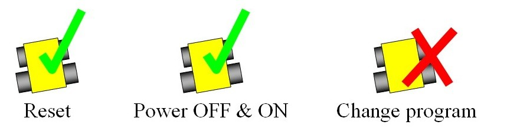

= RoboCupJunior Rescue Maze Rules 2019
{docdate}
:toc: left
:sectanchors:
:sectlinks:
:xrefstyle: full
:section-refsig: Rule
:sectnums:

ifdef::basebackend-html[]
++++
<link rel="stylesheet" href="https://use.fontawesome.com/releases/v5.3.1/css/all.css" integrity="sha384-mzrmE5qonljUremFsqc01SB46JvROS7bZs3IO2EmfFsd15uHvIt+Y8vEf7N7fWAU" crossorigin="anonymous">

++++
endif::basebackend-html[]

:icons: font
:numbered:

These are the official rules for RoboCupJunior Rescue Maze 2019. They are released by the RoboCupJunior Rescue Technical Committee. The English rules have priority over any translations.

[scenario]
== Scenario

The land is simply too dangerous for humans to reach the victims. Your team has been given a difficult task. The robot must be able to carry out the rescue mission in a fully autonomous mode with no human assistance. The robot must be durable and intelligent enough to navigate through treacherous terrain with hills, uneven land and rubble without getting stuck. The robot must search for victims, dispense rescue kits, and signal the position of the victims so the humans can take over.
Time and technical skills are the essential! Come prepared to be the most successful rescue team

[summary]
== Summary

The robot needs to search through a maze for victims.  The robot should not find the fastest path through the maze, instead it should explore as much of the maze as possible. The robot will get either 10 or 25 points for each victim found. If the robot can deliver a rescue kit close to the victim, it will earn an additional 10 points. The robot must avoid areas with a black floor.
If the robot is stuck in the maze it can be restarted at the last visited checkpoint. A reflective floor indicates checkpoints so the robot can save the position to a map (if it uses a map) in a non-volatile medium and restore it in case of a restart.
If the robot can find its way back to the beginning of the maze after exploring the whole maze it will receive an exit bonus. The robot will also earn a reliability bonus if the robot can exit the maze with a minimum number of restarts.  If the robot can find its way back to the beginning after exploring the maze it will receive 10 bonus points per identified victim as an exit bonus.
The robot can earn additional points by navigating the following obstacles: 

* 20 points for going up a ramp
* 10 points for each visited checkpoint
* 10 points for going down a ramp
* 5 points for passing through each tile with speed bumps

*Official RoboCupJunior site:* http://robocupjunior (under Rescue)

*Official RoboCupJunior forum:* https://junior.forum.robocup.org/

== Field

=== Description

The field layout may consist of multiple distinct areas. Areas will have a horizontal floor and a perimeter wall.

Areas may be joined together by doorways or ramps. 

Walls that make up the maze are at least 15 cm high. Their width can reduce the available space for doorways and paths (see 1.1.4, 1.1.5 and 1.3.2)

Doorways are at least 30 cm wide.

Ramps will be at least 30 cm wide and have an incline with a maximum of 25 degrees from the horizontal. Ramps are always straight.

=== Floor

Floors may be either smooth or textured (like linoleum or carpet) and may have steps of up to 3 mm in height between the tiles. There may be holes in the floor (approximately 5 mm in diameter), for fastening walls.

Black tiles in the field represent “no go” spaces. Black tiles will be placed randomly at the start of each round. Black tiles may not be completely fixed to the floor.

Silver tiles in the field represent checkpoints. Silver tiles may not be completely fixed to the floor.

A tile is defined as a 30 x 30 cm space, which is aligned to the grid made up by the walls.

=== Path

Walls may or may not lead to the entrance/exit. Walls that lead to the entrance/exit are called “linear walls.” The walls that do NOT lead to the entrance/exit are called “floating walls.”

The width of the path is 29 cm, and may open into foyers wider than the path.

One of the outermost tiles is the starting tile, where a robot should start and exit the run. 

Walls may be removed, added or changed just before a run starts to prevent teams pre-mapping the layout of the fields. Organizers will do their best to not change the length or difficulty of the maze when introducing these changes.

=== Speed Bumps, Debris and Obstacles

Speed bumps are fixed to the floor and have a maximum height of 2cm. 

Debris is not fixed to the floor and has a maximum height of 1cm. 

Debris may be adjacent to walls.

Obstacles:

. have minimum height of 15 cm.
. may consist of any large, heavy items.
. may be fixed to the floor.
. may be any shape including rectangular, pyramidal, spherical or cylindrical.

An obstacle may be placed in any location where at least 20 cm is left between the obstacle and any wall. 

Obstacles that are moved or knocked over must remain where they are moved or fall and will not be reset during the scoring run.

=== Victims

There are two types of victims: heated victims and visual victims.

Each heated victim has a surface area greater than 16 cm².

Victims are located near the floor of the field (located about 7 cm above the floor, see the figure below). The victim's body temperature simulates human body temperature between 28 ° C and 40 ° C.). The temperature of the victim simulates human body temperature between 28°C to 40°C.

The organizers will try to keep a minimum difference of 10°C between heated victims' temperatures and the ambient temperature of the field. 

There may be objects that resemble heated victims in appearance but are not victims. Such objects should not be identified as victims by robots.

Visual victims are uppercase letters printed on or attached to the wall. They are printed in black, using a sans serif typeface such as “Arial”. Their height will be 4 cm. The letters represent the health status of the victim.
. Harmed victim: H
. Stable victim: S   
. Unharmed victim: U

There will be a minimum number of five (5) heated victims in a field.

There will be more heated than visual victims in a field.

Victims will never be located on black tiles or on tiles with obstacles.

image::media/maze/visual_victim_height.png[]

=== Rescue Kits

A rescue kit represents a basic health package distributed to a victim caught in a natural disaster. It symbolizes tools, medical supplies or devices used in the rescue process, such as GPS transponders or even something as simple as a light source.  

Because we need to ensure that a rescue kit reaches the victim, it has to stay near the victim after the deployment. For example, it cannot roll away from or bounce off to move away from the victim.

Each rescue kit must have a minimum volume of 1 cm³.

A robot can only carry a maximum number of 12 rescue kits.

Each team is responsible for their own rescue kit system, including bringing the rescue kits to the competition. The team captain is responsible for loading the rescue kits onto their robot and collecting it from the field with the referee’s/judge’s authorization after the end of the run.

=== Environmental Conditions

The environmental conditions at a tournament will be different from the conditions at home practice fields. Teams must come prepared to adjust their robots to the conditions at the venue.

Lighting and magnetic conditions may vary in the rescue field.

The field may be affected by magnetic fields (e.g. generated by under floor wiring and metallic objects). Teams should prepare their robots to handle such interference. Organizers and referees will do their best to minimize external magnetic interference.

The field may be affected by unexpected lightning interference (e.g. such as camera flash from spectators). Teams should prepare their robots to handle such interference. Organizers and referees will do their best to minimize external lighting interference.

The Organizing Committee (OC) will try their best to fasten the walls onto the field floor so that the impact from contact should not affect the robot. 

All measurements in the rules have a tolerance of ±5%. 

Objects to be detected by the robot will be distinguishable from the environment by their colour, shape or heat signature.

== Robots

=== Control

Robots must be controlled autonomously. The use of a remote control, manual control, or passing information (by sensors, cables, wirelessly, etc.) to the robot is not allowed.

Robots must be started manually by the team captain.

Robots may utilize various maze navigation algorithms. Any pre-mapped type of dead reckoning (movements predefined based on known locations or placement of features in the field) is prohibited.

A robot must not damage any part of the field in any way.

Robots should include a stop/pause button so they may be easily stopped/paused by the team captain to avert any potentially damaging or illegal robot actions.

=== Construction

The height of a robot must not exceed 30 cm.

Robots may not have any sensor or devices that enables it to 'see' over the walls.

Any robot kit or building blocks, either available on the market or built from raw hardware, may be used as long as the design and construction are primarily and substantially the original work of the students (see section 2.5. below).

Teams are not permitted to use any commercially produced robot kits or sensors components that are specifically marketed to complete any major task of RoboCupJunior Rescue. Robots that do not comply will face immediate disqualification from the tournament. If there is any doubt, teams should consult the Technical Committee (TC) prior to the competition. 

For the safety of participants and spectators, only lasers of class 1 and 2 are allowed. This will be checked during inspection. Teams using lasers must be able to show the sensor’s data/information sheet.

Bluetooth Class 2, 3 and ZigBee communications are the only wireless communication types allowed in RoboCupJunior. Robots that have other types of wireless communications will need to be removed or disabled to prevent possible interference with other leagues competing in RoboCup. If the robot has equipment for other forms of wireless communication, the team must prove that they have been disabled. Robots that do not comply may face immediate disqualification from the tournament.

Robots may incur damage by falling off the field, making contact with another robot, or making contact with field elements.  The organizing committee cannot anticipate all potential situations where damage to the robot may occur. Teams should ensure that all active elements on a robot are properly protected with resistant materials. For example, electrical circuits must be protected from all human contact and direct contact with other robots and field elements.

When batteries are transported or moved, it is recommended that safety bags be used. Reasonable efforts should be made to ensure that robots avoid short circuits and chemical or air leaks.

=== Team

Each team must have only one robot in the field.

Each team must have between 2 and 4 members.

A student can be registered on only one team.

Each team member will need to explain their work and should have a specific technical role.

A team is only allowed to participate in one league: Rescue Line or Rescue Maze or Rescue Simulation.

All team members must be the correct age as stated on the RCJ website: http://junior.robocup.org/robocupjunior-general-rules/.

Mentors/parents are not allowed to be with the students during the competition. The students will have to self-govern themselves (without mentor's supervision or assistance) during the long stretch of hours at the competition.

=== Inspection

The robots will be scrutinized by a panel of referees before the start of the tournament and at other times during the competition to ensure that they meet the constraints described in these rules.

It is illegal to use a robot that is very similar to another team’s robot from a previous year or the current year.

It is the responsibility of the team to have their robot re-inspected, if their robot is modified at any time during the tournament.

Students will be asked to explain the operation of their robot in order to verify that construction and programming of the robot is their own work.

Students will be asked about their preparation efforts and may be requested to answer surveys and participate in video-taped interviews for research purposes.

All teams must complete a web form prior to the competition to allow judges to better prepare for the interviews.  Instructions on how to submit the form will be provided to the teams prior to the competition. 

All teams must submit their source code prior to the competition. The source code will not be shared with other teams without the team’s permission.

All teams must submit their engineering journal prior to the competition. The journals will not be shared with other teams without the team’s permission. However, it is highly recommended that teams publicly share their engineering journal. With the teams that indicate that their engineering journals could be shared publicly during the registration process, the journal alongside their poster presentation will be shared through the RoboCupJunior Forum so that other teams could learn from them.

=== Violations

Any violations of the inspection rules will prevent the offending robot from competing until modifications are made and the robot passes inspection.

Modifications must be made within the time schedule of the tournament and teams cannot delay tournament play while making modifications.

If a robot fails to meet all specifications (even with modifications), it will be disqualified from that round (but not from the tournament).

No mentor assistance is allowed during the competition. (See 6. Code of Conduct.)

Any violations of the rules may be penalized by disqualification from the tournament or the round or may result in a loss of points at the discretion of the referees, officials, organizing committee or general chairs.

== Play

=== Pre-round Practice

When possible, teams will have access to practice fields for calibration and testing throughout the competition.

Whenever there are dedicated independent fields for competition and practice, it is at the organizers’ discretion if testing is allowed on the competition fields.

=== Humans

Teams should designate one of their members as “captain” and another one as “co-captain”. Only these two team members will be allowed access to the competition fields, unless otherwise directed by a referee. Only the captain will be allowed to interact with the robot during a scoring run.  

The captain can move the robot only when they are told to do so by the referee.

Other team members (and any spectators) within the vicinity of the rescue field have to stand at least 150 cm away from the field while a robot is active, unless otherwise directed by the referee.

No one is allowed to touch the fields intentionally during a scoring run.

=== Start of Play

A run begins at the scheduled starting time whether or not the team is present or ready. Start times will be posted around the venue.

Once the scoring run has begun, the robot is not permitted to leave the competition area for any reason. Each run lasts a maximum of 8 minutes.

Calibration is defined as the taking of sensor readings and modifying a robot’s program to accommodate such sensor readings. Teams may calibrate their robot in as many locations as desired on the field, but the clock will continue to run. Robots are not permitted to move on their own while calibrating. 

Calibration involving pre-mapping the field and/or victims’ location is prohibited. Pre-mapping activities will result in immediate robot disqualification for the round.

Before a scoring run begins, the referee will roll a standard 6-sided dice to determine the location of the black and silver tiles. The position of the black tiles will not be revealed to the team until they are ready to start a scoring run (see 3.3.7). Referees will ensure the combination of black tile placements in a field layout is 'solvable' before a robot begins a scoring run.

Before a scoring run begins the judge can change any walls of the field, (see 1.3.4).

Once the robot is started, a referee will place the black and silver tiles.

Once a scoring run has begun, no additional calibration is permitted (this includes changing of code/code selection).

=== Game Play

Modifying the robot during a scoring run is prohibited, which includes remounting parts that have fallen off.

Any parts that the robot loses intentionally or unintentionally will be left in the field until the run is over. Team members and judges are not allowed to remove parts from the field during a scoring run.

Teams are not allowed to give their robot any advance information about the field. A robot is supposed to recognize the field elements by itself.

A “visited tile” means that more than half of the robot is inside the tile when looking from above.

=== Scoring

A robot can carry out one or both of the following actions to successfully identify a victim:

. stop for 5 seconds within 15 cm of the victim and blink a visual indicator on and off for the full 5 seconds.
. Stop for 5 seconds and deploy a rescue kit (see 3.5.3) within 15cm of the victim.
N.B.: The visual indicator must be placed in a clearly visible area. 

Points are rewarded points for each Successful Victim Identification in the field:

. 10 points per victim located on a tile adjacent to a linear wall (even diagonally), i.e. all victims at the 6 tiles around a linear wall. 
. 25 points per victim on other walls.

In the above diagram, red lines represent floating walls while the black lines represent linear walls.
Note that some of the victims on the floating walls are worth 10 points, this is because the 10 points victims are located in a tile near a linear wall. The colours on the diagram are just for illustrative purposes.
The field designer must keep in mind this rule when deciding on the location of the black tiles, which can be changed during the run via a dice roll; in order to keep the maximum score consistent

To successfully deploy a rescue kit, a robot must deploy (deployment point) a rescue kit within 15 cm of the victim. The deployment point is deemed to be the location where the rescue kit makes initial contact with the floor, it is not the final resting place of the rescue kit.

10 points are awarded per successful rescue kit deployment. The following amounts of rescue kits can score points:

* Heated victims: one rescue kit per victim. (Maximum points for rescue kit deployment per victim: 10 points.)
* Visual victims: 
  . Harmed (H): two rescue kits. (Maximum points for rescue kit deployment per victim: 20 points.)
  . Stable (S): one rescue kit per victim. (Maximum points for rescue kit deployment per victim: 10 points.)
  . Unharmed (U): zero rescue kits per victim. 

Points will be awarded for victim identification and rescue kit deployment.

Reliability Bonus = the number of ‘successful victim identification’ x 10 + the number of ‘successful rescue deployment’ x 10, minus the number of ‘Lack of Progress’ x 10. However, Reliability Bonus score can only be reduced to the minimum of 0 points.

Successful Speed Bump Crossing. For each tile with speed bumps passed, a robot is awarded 5 points.

Successful Up Ramp Negotiation. A robot is awarded 20 points for a successful climb up a ramp. To successfully climb up a ramp, a robot needs to move from the bottom horizontal tile before the ramp to the top horizontal tile after the ramp.

Successful Down Ramp Negotiation. A robot is awarded 10 points for successfully landing at the bottom of a ramp. A robot needs to move from the top horizontal tile of the ramp to the bottom horizontal tile of the ramp. A successful landing means that the robot can leave the tile without assistance. 

Successful Checkpoint Negotiation. A robot is awarded 10 points for each visited checkpoint. Refer to 3.4.4 for definition of visited tile.

Successful Exit Bonus. A robot is awarded 10 points for each victim successfully identified (see 3.5.1).
The “exit bonus” condition is satisfied when the robot returns to the starting tile, stays there for at least 10 seconds to complete the scoring run.

Ties at the end. Ties in scoring will be resolved based on the time each robot took to complete the run.

No duplicate rewards. For example, if a robot successfully crosses a tile with speed bumps multiple times, only one successful speed bump crossing will be rewarded per tile. The same result applies to all other scoring rules.

Misidentification. If a robot identifies a victim through methods outlined in 3.5.1, but is outside the 15cm radius of any victim, 5 points will be deducted. This doesn’t apply to delivering the incorrect number of rescue kits to visual victims. The total points will never go below zero points.

=== Lack of progress

A Lack of Progress occurs when:
. the team captain declares a Lack of Progress.
. a robot fails to retreat from a “visited” black tile. For a successful retreat, the robot needs to back up without turning inside the black tile (it has to move straight backwards inside of a black tile). See definition of visited tile on rule 3.4.4.
. a robot damages the field.
. a team member touches the field or their robot without permission from a referee.

In the event of a lack of progress, the robot must return to the last visited checkpoint (or the start tile if never reached a checkpoint). The robot can be installed in any direction. For the definition of the visited tile (see 3.4.4).

After a Lack of Progress, the team may reset the power supply (turn the robot off and on) and subsequently restart the program. The team is not allowed to change the program, give any information about the field to the robot, or repair the robot. Teams must notify the judge prior to their run what procedure will be performed when a lack of progress occurs; teams must stick to this method regardless of the situation.

=== End of Play

A team may elect to stop the round early at any time. In this case, the team captain must indicate to the referee the team's desire to terminate the run. The team will be awarded all points earned up to the call for the end of the round.

The round ends when:
. the time expires.
. the team captain calls end of round.
. the robot returns to the start tile and gets the exit bonus.

== Open Technical Evaluation

=== Description

Your technical innovation will be evaluated during a dedicated time frame. All teams need to prepare for an open display during this time frame. 

Judges will circulate and interact with the teams. The Open Technical Evaluation is intended to be a casual conversation with a "question and answer" atmosphere. 

The main objective of the Open Technical Evaluation is to emphasize the ingenuity of innovation. Being innovative may mean technical advances as compared to the existing knowledge, or an out-of-the-ordinary, simple but clever, solution to existing tasks.

=== Evaluation Aspects

A standardized rubric system will be used focusing on:
. creativity
. cleverness
. simplicity
. functionality

Your “work" can include (but is not limited to) one of the following aspects: 
. creation of your own sensor instead of a pre-built sensor
. creation of a "sensor module" which is comprised of various electronics resulting in a self-contained module to provide a certain functionality
. creation of a mechanical invention which is functional, but out of the ordinary
. creation of a new software algorithm to a solution

Teams must provide documents that explain their work. Each invention must be supported by concise but clear documentation. The documents must show precise steps towards the creation of the invention. 

Documents must include one poster and one engineering journal (see the Engineering Journal Template on official RCJ website for more details). Teams should be prepared to explain their work. 

Engineering Journals should demonstrate your best practices in the development process. 

The poster should include name of team, country, league, robot description, robot capabilities, controller and programming language used, sensors included, method of construction, time used for development, cost of materials and awards won by the team in its country, etc. 

Guidelines may be provided at the official RCJ website under Rescue rules (Engineering Journal Template).

=== Sharing

Teams are encouraged to review other's posters and presentations.

Teams awarded with certificates are required to post their documents and presentation online when asked by the OC/TC.

== Conflict Resolution

=== Referee and Referee Assistant

All decisions during game play are made by the referee or the referee assistant, who are in charge of the field, persons and objects surrounding them. 

During game play, the decisions made by the referee and/or the referee assistant are final.

At conclusion of game play, the referee will ask the captain to sign the score sheet. Captains will be given a maximum of 1 minute to review the score sheet and sign it. By signing the score sheet, the captain accepts the final score on behalf of the entire team.  In case of further clarification, the team captain should write their comments on the score sheet and sign it.

=== Rule Clarification

If any rule clarification is needed, please contact the International RoboCupJunior Rescue Technical Committee.

If necessary even during a tournament, a rule clarification may be made by members of the RoboCupJunior Rescue Technical Committee (TC) and Organizing Committee (OC).

=== Special Circumstances

If special circumstances, such as unforeseen problems or capabilities of a robot occur, rules may be modified by the RoboCupJunior Rescue Organizing Committee Chair in conjunction with available Technical Committee and Organizing Committee members, even during a tournament.

If any of the team captains/mentors do not show up to the team meetings to discuss the problems and the resulting rule modifications described at 5.3.1, it will be considered as an agreement.

== Code of Conduct

=== Spirit

It is expected that all participants (students and mentors alike) will respect the aims and ideals of RoboCupJunior as set out in our mission statement.

The volunteers, referees and officials will act within the spirit of the event to ensure the competition is competitive, fair and, most importantly, fun.

*It is not whether you win or lose, but how much you learn that counts!*

=== Fair Play

Robots that cause deliberate or repeated damage to the field will be disqualified.

Humans that cause deliberate interference with robots or damage to the field will be disqualified.

It is expected that the aim of all teams is to participate fairly.

=== Behavior

Each team is responsible for verifying the latest version of the rules on the RoboCupJunior Official website prior to the competition.

Participants should be mindful of other people and their robots when moving around the tournament venue.

Participants are not allowed to enter setup areas of other leagues or other teams, unless explicitly invited to do so by team members.

Teams will be responsible for checking updated information (schedules, meetings, announcements, etc.) during the event. Updated information will be provided on notice boards in the venue and (if possible) on the local competition website and/or the RoboCup or RoboCupJunior websites.

Participants who misbehave may be asked to leave the venue and risk being disqualified from the tournament.

These rules will be enforced at the discretion of the referees, officials, tournament organizers and local law enforcement authorities.

Teams are expected to be present at the venue early on the setup day as important activities will occur.  These activities include, but are not limited to: registration, participation raffle, interviews, captains and mentor’s meetings.

=== Mentors

Adults (mentors, teachers, parents, chaperones, translators and other adult team members) are not allowed in the student work area.

Sufficient seating will be supplied for mentors to remain in a supervisory capacity close to the student work area.

Mentors are not permitted to build, repair or be involved in programming of their team’s robots both before and during the competition.

Mentor interference with robots or referee decisions will result in a warning in the first instance. If this recurs, the team will risk being disqualified.

Robots have to be mainly students' own work. Any robot that appears to be identical to another robot may be prompted for re-inspection.

=== Ethnics and Integrity

Fraud and misconduct are not condoned. Fraudulent acts may include the following:

. Mentors working on the software or hardware of students’ robot(s) during the competition.
. More experienced/advanced groups of students may provide advice but should not do the work for other groups. Otherwise, the team risks being disqualified. 

RoboCupJunior reserves the right to revoke an award if fraudulent behavior can be proven after the award ceremony takes place.

If it is clear that a mentor intentionally violates the code of conduct, and repeatedly modifies and works on the students' robot(s) during the competition, the mentor will be banned from future participation in RoboCupJunior competitions.

Teams that violate the code of conduct can be disqualified from the tournament. It is also possible to disqualify a single team member from further participation in the tournament.

In less severe cases of violations of the code of conduct, a team will be given a warning. In severe or repeated cases of violations of the code of conduct, a team can be disqualified immediately without a warning.

=== Sharing

The spirit of world RoboCup competitions is that any technological and curricular developments should be shared with other participants after the tournament.

Any developments may be published on the RoboCupJunior website after the event.

Participants are strongly encouraged to ask questions to their fellow competitors to foster a culture of curiosity and exploration in the fields of science and technology.

This furthers the mission of RoboCupJunior as an educational initiative.
